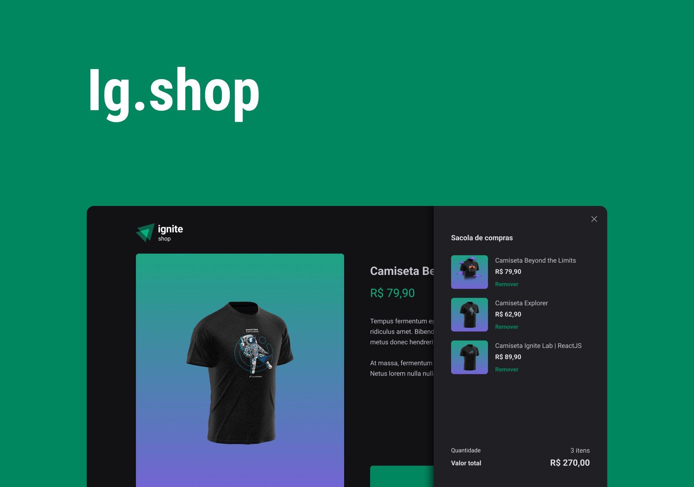
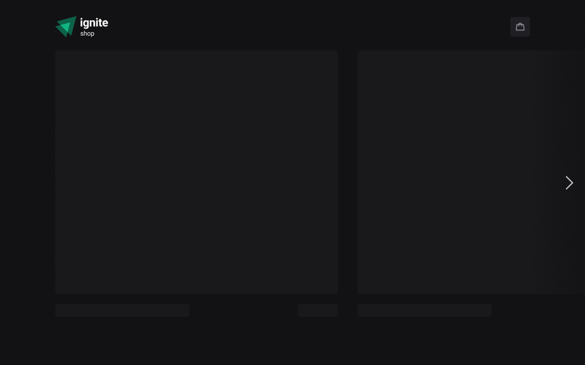
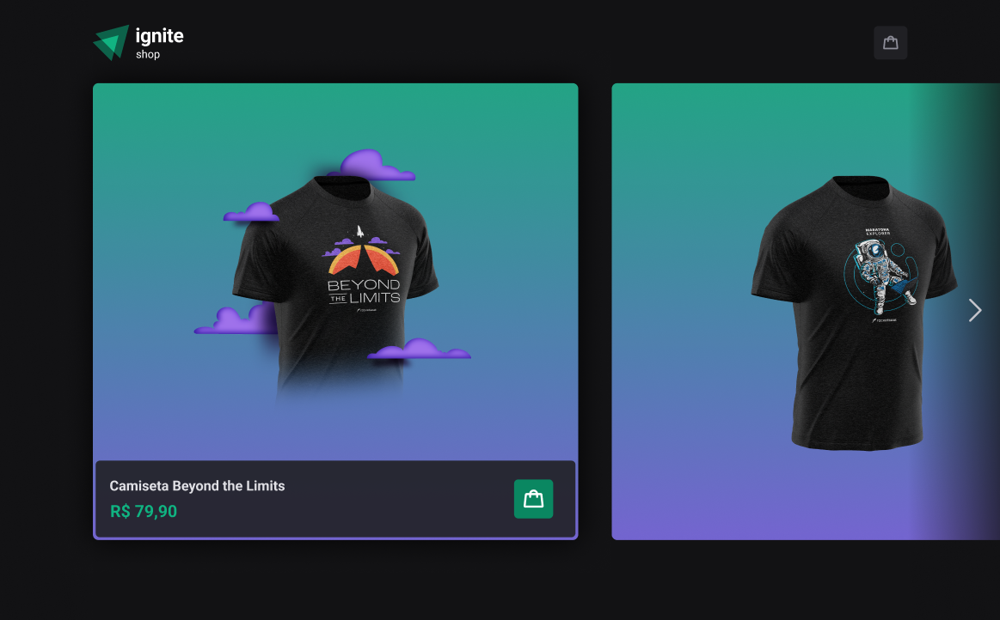
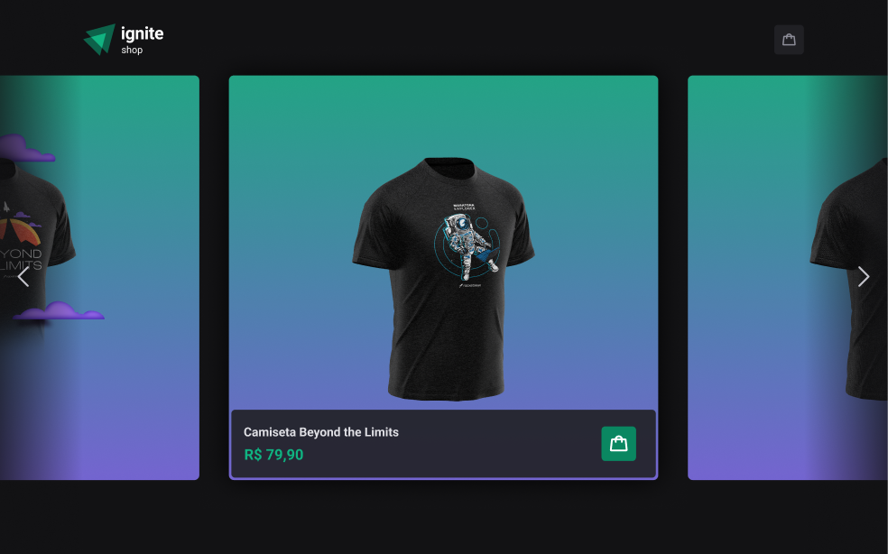
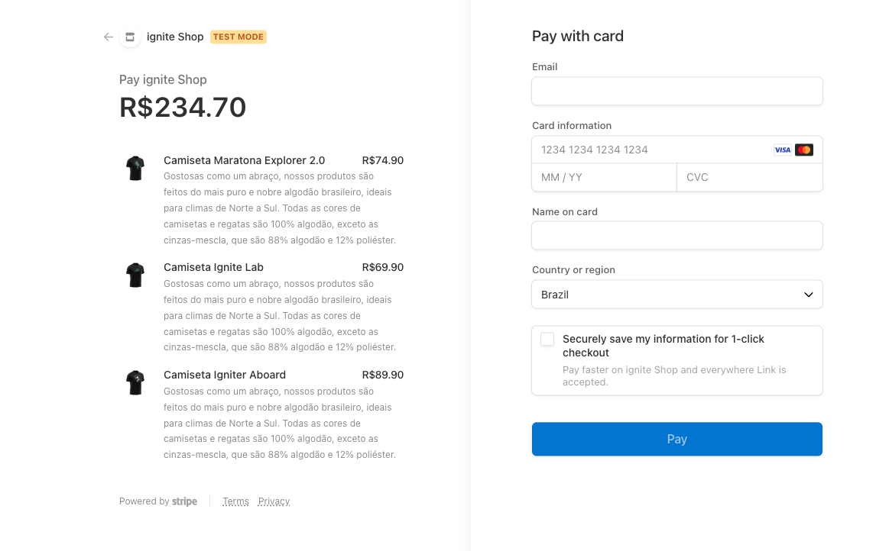
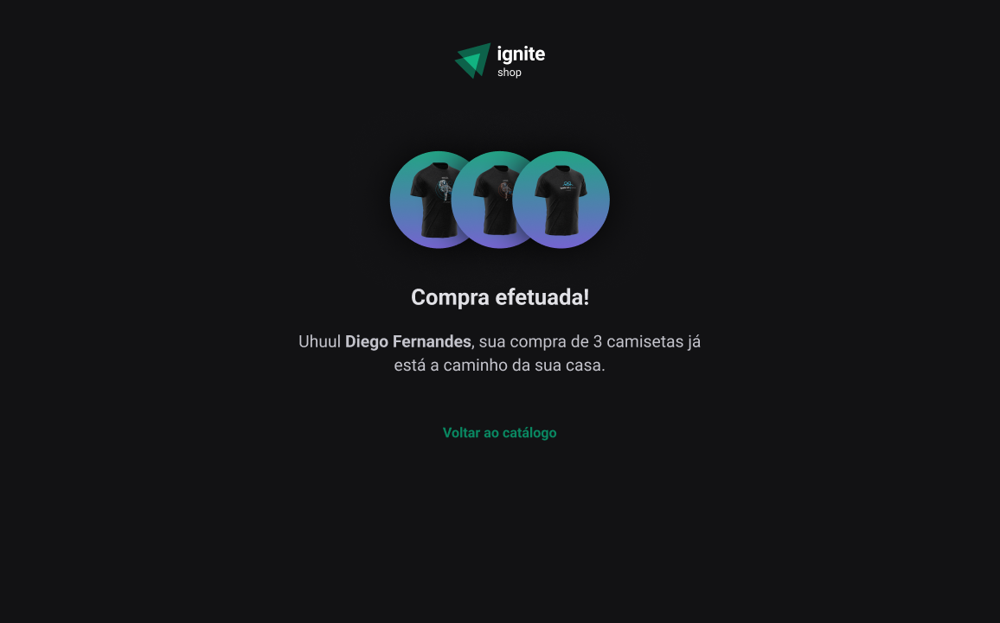

<h1 align="center">


</h1>

<p align="center">
  Ig.shop - Shopping cart system
  <br>
  <br>

  <a href="www.linkedin.com/in/rhalfoliveira">
    
  </a>

  <a href="https://github.com/qwwerty/letmeask/commits/master">
    
  </a>

</p>

<p align="center">
  <a href="#dart-sobre">About</a> &#xa0; | &#xa0; 
  <a href="#rocket-tecnologias">Technologies</a> &#xa0; | &#xa0;
  <a href="#white_check_mark-requerimentos">Requirements</a> &#xa0; | &#xa0;
  <a href="#checkered_flag-começando">Starting</a> &#xa0; &#xa0; | &#xa0;
  <a href="#framed_picture-imagens">Images</a> &#xa0; &#xa0;
</p>

<br>

## :dart: About

Shopping cart system with Stripe Js integration. The user will be able to choose several products that make up his cart, after all the choices, the payment will be made with Stripe.

## :rocket: Technologies

The following technologies were used in the project:

- [Vite](https://vitejs.dev/)
- [NextJs](https://nextjs.org/)
- [Typescript](https://www.typescriptlang.org/)
- [Keen Slider](https://keen-slider.io/)
- [use-shopping-cart](https://useshoppingcart.com/)
- [Stripe](https://stripe.com/en-br)
- [NProgress](https://ricostacruz.com/nprogress/)
- [Axios](https://axios-http.com/)

## :white_check_mark: Requirements

- [Node](https://nodejs.org/en/)
- [Npm](https://www.npmjs.com/)
- [Yarn](https://yarnpkg.com/lang/en/)

## :checkered_flag: Starting

```bash
# Clone this project
$ git clone https://github.com/qwwerty/Ig.shop

# Access
$ cd Ig.shop

# Install dependencies
$ yarn install

# Run the project
$ yarn dev

# The server will initialize in the <http://localhost:3000>
```

## :point_right: Figma

- [Figma](<https://www.figma.com/file/Kc8HVxwGUB0BrApZrPY6jk/Ignite-Shop-2.0-(Copy)?node-id=0%3A1&t=scE5guMtOlnqQvnf-1>)

## :framed_picture: Images

<h1 align="center">
    
</h1>

<h1 align="center">
    
    
    
    
    
    
    
</h1>
